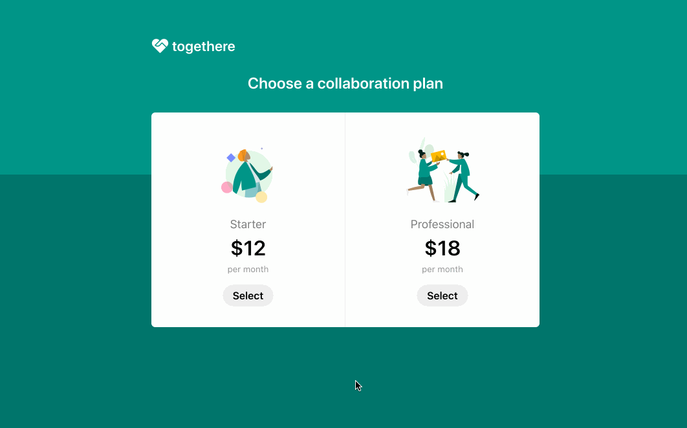

# -----> DOCUMENTATION - UNITED <-----

## Requirements

- Python 3
- [Configured .env file](../README.md)

## How to run

<details>
<summary>Enabling Stripe Tax</summary>

   In the [`server.py`](./server.py) file you will find the following code commented out
   ```python
   # automatic_tax={'enabled': True},
   ```

   Uncomment this line of code and the sales tax will be automatically calculated during the checkout.

   Make sure you previously went through the set up of Stripe Tax: [Set up Stripe Tax](https://stripe.com/docs/tax/set-up) and you have your products and prices updated with tax behavior and optionally tax codes: [Docs - Update your Products and Prices](https://stripe.com/docs/tax/checkout#product-and-price-setup)
</details>

1. Create and activate a new virtual environment

**MacOS / Unix**

```
python3 -m venv env
source env/bin/activate
```

2. Install dependencies

```
pip install -r requirements.txt
```

3. Export and run the application

**MacOS / Unix**

```
export FLASK_APP=server.py
python3 -m flask run --port=4242
```


# Client Library Fundamentals 
https://stripe.com/docs/videos/developer-foundations?video=webhook-helpers

# Webhooks & Event Listeners
**Interactice webhook builder:** https://stripe.com/docs/webhooks/quickstart
https://stripe.com/docs/billing/subscriptions/webhooks
https://stripe.com/docs/webhooks/quickstart
https://stripe.com/docs/webhooks?shell=true&api=true
https://stripe.com/docs/billing/subscriptions/webhooks#events
https://stripe.com/docs/cli/listen

# Cancel Subscription
https://stripe.com/docs/api/subscriptions/cancel

# Refunds
https://stripe.com/docs/refunds?dashboard-or-api=api#issuing


*--------------------------------------*


###### DATABASE ######
  
  # POSTGRES DATABASE
  https://wiki.postgresql.org/wiki/Psycopg2_Tutorial

  -> In order to connect to the postgres db, **psycopg2** must be installed. 
  -> The use of **postgresql://** instead of **postgres://** in the         'SQLALCHEMY_DATABASE_URI' is also needed

  # INTERACT WITH POSTGRES DATABASE USING **psqls**

  > Login:
  # Set user name(default is root user)
  $ psql -U united
  # Log in
  $ psql -h localhost -p <default postgress port is 5432 > -U yourusername -d yourdatabasename

  > List all tables:
  $ \dt

  Check structure/schema of tables:
  $ \d table_name

  > Migrate data & export table structures from db in docker container
  > This will create a dump file in the current directory
  $ docker exec -it container_id_or_name pg_dump -U username -d database_name > dump.sql
  $ <enter db password> <NOTE: You will not be explicitly prompted to enter the password>

  > Load into new DB
  $ psql <connection string> < dump.sql

*--------------------------------------*


  # FLASK SHELL

  > Open Shell
  $ flask shell
  > Import db object from extensions module to interact with database
  $ from app.extensions import db
  > Print db to check connection
  $ print(db)
  > Import modules to be created
  $ from app.models import CustomerDB, Address, Bin, Subscription, Invoice, Role, User
  > Create modules - expect no output
  $ db.create_all()
  > Inspect database tables
  $ from sqlalchemy import inspect
  $ inspector = inspect(db.engine)
  $ print(inspector.get_table_names())
  > Query data
  $ from app.models import CustomerDB, Address etc...
  $ cus = CustomerDB.query.all()
  $ print(cus)
  > Add Existing Roles in models module
  $ flask shell
  $ Role.insert_roles()
  $ Role.query.all()
  > Update User List or any model column once db has been changed - p. 344
  $ flask shell
  $ admin_role = Role.query.filter_by(name='Administrator').first()
  $ default_role = Role.query.filter_by(default=True).first()
  $ for u in User.query.all():
  ...     if u.role is None:
  ...         if u.email == app.config['UNITED_ADMIN]:
  ...             u.role = admin_role
  ...         else:
  ...             u.role = default_role
  ...
  $ db.session.commit()


*--------------------------------------*


# FLASK SQLALQUEMY BLUEPRINT & FILE STRUCTURE
  https://www.digitalocean.com/community/tutorials/how-to-structure-a-large-flask-application-with-flask-blueprints-and-flask-sqlalchemy#creating-the-main-blueprint-and-rendering-its-templates


*--------------------------------------*


#  TEST API ROUTES USING HTTPie Flask WebDev pg 431
http --json --auth <str:email>:<str:password> GET http://localhost:5000/api/v1/customers


*--------------------------------------*


# CONFIGURE FLASK TO RUN ON DOCKER WITH POSTGRES 
https://testdriven.io/blog/dockerizing-flask-with-postgres-gunicorn-and-nginx/#project-setup

https://realpython.com/docker-continuous-integration/#run-a-redis-server-through-docker

https://testdriven.io/blog/docker-best-practices/


*--------------------------------------*


**DOCKER**

>Build image after changes
  > -t tags a name . stands for current dir
--> $ docker build -t united .

>The below is not needed when running docker-compose
--> $ docker run server.py

>list containers
--> $ docker ps

>also lists containers that are stopped
--> # docker ps -a  

>Access terminal within container
--> $ docker exec -it <container-id OR name> /bin/bash

>View Logs
--> $ docker logs <container_id_or_name>

>Follow Logs in real-time
--> $ docker logs -f <container_id_or_name>

>Access DB from image
--> $ docker-compose exec db psql --username=<username> --dbname=<databasename> 

>Inpect DB Volume
--> $ docker volume inspect <db_name>

>Check for errors on containers
--> $ docker-compose -f docker-compose.prod.yml logs -f 

>Build specific docker-compose file
--> $ docker-compose -f docker-compose.prod.yml up -d --build

>Stop Nginx
--> $ docker-compose -f docker-compose.prod.yml stop nginx

>Configure CI/CD for your Python application
  https://docs.docker.com/language/python/configure-ci-cd/

>Yes, you would need to run `docker-compose up -d --build` again after running `docker-compose down -v`.

>Here's what the command does:

> `docker-compose up`: This command starts and runs your entire app. Docker Compose will start and run your entire app by using the `docker-compose.yml` file which defines your multi-container application.

>`-d`: This option runs the containers in the background (detached mode).

> `--build`: This option tells Docker Compose to build images before starting containers. If you've made changes to your Dockerfile since the last time you ran `docker-compose up`, you'll need this option to ensure your changes are included in the containers that are started.

>So, after running `docker-compose down -v`, running `docker-compose up -d --build` will rebuild your images and start your containers again, incorporating any changes you've made to your Dockerfile or application code.


*--------------------------------------*


**GCLOUD**

# GOOGLE CLOUD RUN

- $ gcloud auth login (if gcloud has already been installed)

Set project
- $ gcloud config set project <PROJECT_ID>

Authenticate gcloud CLI
- $ gcloud auth application-default login


*--------------------------------------*


**Infrastructure As Code (IaC)**
>https://www.youtube.com/watch?v=YGcd0lAQCl8
# Pulumi
>Resources

>https://www.pulumi.com/docs/clouds/gcp/get-started/

>https://www.pulumi.com/docs/clouds/gcp/get-started/create-project/

>https://www.pulumi.com/docs/using-pulumi/organizing-projects-stacks/

>Run installation script
- $ curl -fsSL https://get.pulumi.com | sh

>Create Container Service on Googgle Cloud > https://www.pulumi.com/templates/container-service/gcp/
- $ pulumi new container-gcp-python

>Manage and view state
- $ pulumi stack

>Set the default destination org for all stack operations
- $ pulumi org set-default NAME

> View backend, current stack, pending operations, and versions
- $ pulumi about

> Logout login
- $ pulumi logout && pulumi login

> Create bucket/Deploy
- $ pulumi up

> Update changes - Same as above
- $ pulumi up

> Destroy resources on gcloud
  > Note that the stack will still be defined
- $ pulumi destroy

> Remove the stack
- $ pulumi rm dev

> Set region
- $ pulumi config set gcloud:region <australia-southeast1>

> Get region
- $ pulumi config get gcloud:region

> * Error updating Service "locations/australia-southeast1/namespaces/stripe-checkout-424311/services/service-c4790b5": googleapi: Error 409: Conflict for resource 'service-c4790b5': version '1716904170281583' was specified but current version is '1717335246426735'.
> Usually running the below should fix the issue
> NOTE: mix of manual and managed deployment might trigger this issue
- $ pulumi refresh
- $ pulumi up


*--------------------------------------*


**GCLOUD Artifac Registry For Docker**
> https://cloud.google.com/artifact-registry/docs/docker/authentication
# Configure Authentication

>Initialise CLI
- $ gcloud init

> Enable the API from Google Cloud console or with the following gcloud command:
- $ gcloud services enable artifactregistry.googleapis.com

> Disable the API
- $ gcloud services disable artifactregistry.googleapis.com

> https://cloud.google.com/artifact-registry/docs/docker/authentication#gcloud-helper
- $ gcloud auth activate-service-account <ComputeEngineDefaultServiceAccount> --key-file=<KEY-FILE>

*--------------------------------------*


#
 STRIPE READ.md BELOW

# Using Checkout for subscriptions

[Checkout](https://stripe.com/docs/payments/checkout) is a pre-built payment page that lets you accept cards and Apple Pay. [Billing](https://stripe.com/docs/billing) is a suite of APIs that lets you model complex subscription plans. You can combine the two products to get a subscription payment page up and running without the need of a server.

When your customer is ready to pay, use [Stripe.js](https://stripe.com/docs/js) with the ID of your [Checkout Session](https://stripe.com/docs/api/checkout/sessions/object) to redirect them to your Checkout page.



**Demo**

See the sample of the integration [live](https://u5n7k.sse.codesandbox.io/) or [fork](https://codesandbox.io/s/github/stripe-samples/checkout-single-subscription/tree/codesandbox) the Node implementation on CodeSandbox.

The demo is running in test mode -- use `4242424242424242` as a test card number with any CVC + future expiration date.

Use the `4000002500003155` test card number to trigger a 3D Secure challenge flow.

Read more about testing on Stripe at https://stripe.com/docs/testing.

**Features:**

- Localization in over 25 different languages 🌍
- Built-in Apple Pay support 🍎
- Built-in dynamic 3D Secure (ready for SCA) 🔔

For more features see the [Checkout documentation](https://stripe.com/docs/payments/checkout/subscriptions).

The integration uses the [Checkout Sessions API](https://stripe.com/docs/api/checkout/sessions) for additional functionality.

<!-- prettier-ignore -->
|      | main |
| :--- | :---: |
| 🔨 **Prebuilt checkout page.** Create a payment page that is customizable with your business' name and logo.   | ✅ |
| 🖥️ **Define prices in Dashboard or via API.** Create a price with either the Stripe Dashboard or API.   | ✅ |
| 🔢 **Start subscription for an existing Customer.** Use [Customers](https://stripe.com/docs/api/customers) to keep track of additional customer data.   | ✅ |

## How to run locally

This sample includes 8 server implementations in Node, Ruby, Python, Java, PHP, PHP with Slim, Go and .NET.

Follow the steps below to run locally.

**1. Clone and configure the sample**

The Stripe CLI is the fastest way to clone and configure a sample to run locally.

***Cloning using the Stripe CLI***

> If you haven't already installed the CLI, follow the [installation steps](https://stripe.com/docs/stripe-cli#install) in the project README. The CLI is useful for cloning samples and locally testing webhooks and Stripe integrations.
> 
> In your terminal shell, run the Stripe CLI command to clone the sample:
> 
> ```sh
> ./stripe samples create checkout-single-subscription
> ```
> 
> The CLI will walk you through picking your server and client languages and configuring your `.env` config file with your Stripe API keys.

***Cloning manually***

> If you do not want to use the Stripe CLI, you can manually clone and configure the sample yourself:
> 
> ```sh
> git clone https://github.com/stripe-samples/checkout-single-subscription
> ```
> 
> Copy the `.env.example` file into a file named `.env` in the folder of the server you want to use. For example:
> 
> ```sh
> cp .env.example server/node/.env
> ```
> 
> You will need a Stripe account in order to run the demo. Once you set up your account, go to the Stripe [developer dashboard](https://stripe.com/docs/development/quickstart#api-keys) to find your API keys.
> 
> ```sh
> STRIPE_PUBLISHABLE_KEY=<replace-with-your-publishable-key>
> STRIPE_SECRET_KEY=<replace-with-your-secret-key>
> ```

**2. Create Products and Prices on Stripe**

This sample requires two [Price](https://stripe.com/docs/api/prices/object) IDs to create the Checkout page. Products and Prices are objects on Stripe that let you model a subscription.

**Using the Stripe CLI**

Create basic product
```sh
./stripe products create --name="Basic" --description="Basic plan"
```

Create premium product
```sh
./stripe products create --name="Premium" --description="Premium plan"
```

Take note of the id value for the products you just created as you will need this to create prices. For example:
```json
{
  "id": "prod_RANDOM_ID_VALUE"
}
```

Create price for Basic product, substituting `ID_OF_BASIC_PRODUCT` with the appropriate product Id:
```sh
./stripe prices create
  -d "product=ID_OF_BASIC_PRODUCT"
  -d "unit_amount=1800"
  -d "currency=usd"
  -d "recurring[interval]=month"
```

Create price for Premium product, substituting `ID_OF_BASIC_PRODUCT` with the appropriate product Id:
```sh
./stripe prices create
  -d "product=ID_OF_PREMIUM_PRODUCT"
  -d "unit_amount=1800"
  -d "currency=usd"
  -d "recurring[interval]=month"
```

<details>
<summary>With Stripe Tax</summary>
  Stripe Tax lets you calculate and collect sales tax, VAT and GST with one line of code.

  Before creating a price, make sure you have Stripe Tax set up in the dashboard: [Docs - Set up Stripe Tax](https://stripe.com/docs/tax/set-up).

  Stripe needs to know what kind of product you are selling to calculate the taxes. For this example we will submit a tax code describing what kind of product is used: `txcd_10000000` which is 'General - Electronically Supplied Services'. You can find a list of all tax codes here: [Available tax codes](https://stripe.com/docs/tax/tax-codes). If you leave the tax code empty, Stripe will use the default one from your [Tax settings](https://dashboard.stripe.com/test/settings/tax).

  ```sh
  ./stripe products create
    -d "name=Premium"
    -d "description=Premium plan"
    -d "tax_code=txcd_10000000"
  ```

  From the response, copy the `id` and create a price. The tax behavior can be either `inclusive` or `exclusive`. For our example, we are using `exclusive`.

  ```sh
  ./stripe prices create
    -d "unit_amount=1800"
    -d "currency=usd"
    -d "tax_behavior=exclusive"
    -d "recurring[interval]=month"
    -d "product=<INSERT_ID, like prod_ABC123>"
  ```

  More Information: [Docs - Update your Products and Prices](https://stripe.com/docs/tax/checkout#product-and-price-setup)
</details>

**Using the Dashboard**

You can create Products and Prices [in the dashboard](https://dashboard.stripe.com/products). Create two recurring Prices to run this sample.

**Update BASIC_PRICE_ID and PRO_PRICE_ID in your .env file**

Repeat these steps for to create a second product and price.

Next, open `.env` in the folder of the server you want to use, and update the values for `BASIC_PRICE_ID` and  `PRO_PRICE_ID` with the price IDs of the two prices you added.

**3. Confirm that you have set the account name**

In order to use Checkout, you must set an account or business name at https://dashboard.stripe.com/account

**4. Follow the server instructions on how to run:**

Pick the server language you want and follow the instructions in the server folder README on how to run.

For example, if you want to run the Node server:

```sh
cd server/node
# There's a README in this folder with instructions to run the server and how to enable Stripe Tax.
npm install
npm start
```

**[Optional] Customize your branding**

To customize your icon, logo and colors for Checkout and the Customer Portal, go to [Branding settings](https://dashboard.stripe.com/account/branding) in the Dashboard.

**[Optional] Run a webhook locally:**

You can use the Stripe CLI to easily spin up a local webhook.

First [install the CLI](https://stripe.com/docs/stripe-cli) and [link your Stripe account](https://stripe.com/docs/stripe-cli#link-account).

```sh
./stripe listen --forward-to "localhost:4242/webhook"
```

The CLI will print a webhook secret key to the console. Set `STRIPE_WEBHOOK_SECRET` to this value in your `.env` file.

You should see events logged in the console where the CLI is running.

When you are ready to create a live webhook endpoint, follow our guide in the docs on [configuring a webhook endpoint in the dashboard](https://stripe.com/docs/webhooks/setup#configure-webhook-settings).

**[Optional] Adjust other environment variables**

The other environment variables are configurable:

`STATIC_DIR` tells the server where to the client files are located and does not need to be modified unless you move the server files.

`DOMAIN` is the domain of your website, where Checkout will redirect back to after the customer completes the payment on the Checkout page.

## FAQ

Q: Why did you pick these frameworks?
 
> We chose the most minimal framework to convey the key Stripe calls and concepts you need to understand. These demos are meant as an educational tool that helps you roadmap how to integrate Stripe within your own system independent of the framework.
 
Q: What happened to Plans and SKUs?

> Plans and SKUs were old ways to model recurring and one-off prices. We created the Prices API to unify the two concepts and make it easier to reason about your pricing catalog. You can still pass old Plan and SKU IDs to Checkout -- to learn more read [our docs](https://stripe.com/docs/payments/checkout/migrating-prices) but know that you do not need to migrate any of your existing SKUs and Plans.

## Get support
If you found a bug or want to suggest a new [feature/use case/sample], please [file an issue](../../issues).

If you have questions, comments, or need help with code, we're here to help:
- on [Discord](https://stripe.com/go/developer-chat)
- on Twitter at [@StripeDev](https://twitter.com/StripeDev)
- on Stack Overflow at the [stripe-payments](https://stackoverflow.com/tags/stripe-payments/info) tag
- by [email](mailto:support+github@stripe.com)

Sign up to [stay updated with developer news](https://go.stripe.global/dev-digest).

## Author(s)

[@adreyfus-stripe](https://twitter.com/adrind)
[@cjavilla-stripe](https://twitter.com/cjav_dev)
